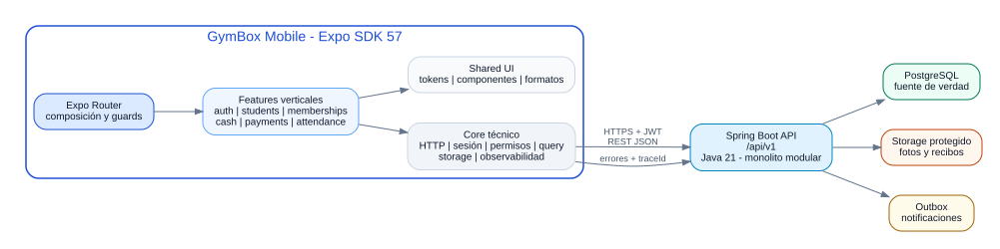
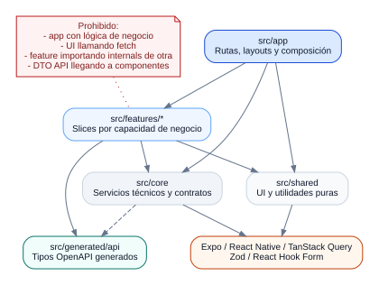
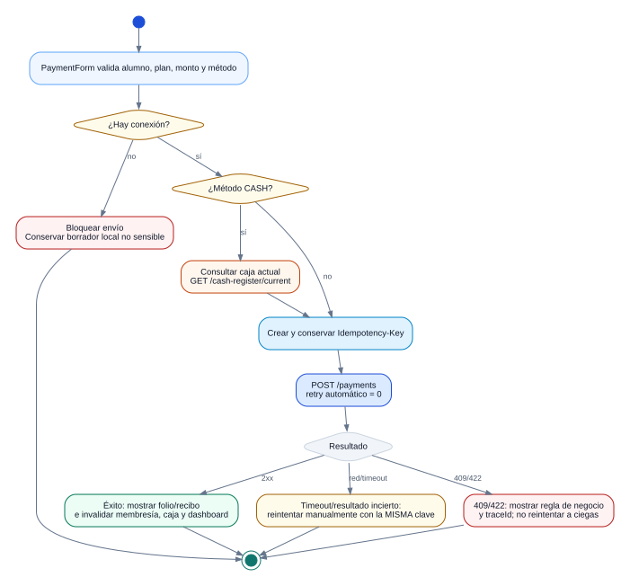

# Resumen ejecutivo

La app móvil de GymBox será una sola aplicación React Native construida con **Expo SDK 57, React Native 0.86, React 19.2 y TypeScript estricto**. En la Fase 1 su función principal será habilitar la operación diaria de **instructores, recepción y administradores autorizados**: iniciar sesión, consultar la clase del día, localizar alumnos, revisar su membresía, abrir o consultar la caja mínima, registrar pagos, obtener el recibo y realizar check-in.

La arquitectura adopta un modelo **feature-first con capas internas**, no una estructura global de `screens/services/repositories`. Las rutas de Expo Router sólo componen pantallas y aplican guards; cada capacidad de negocio vive en un módulo vertical con su API, modelo, casos de uso/hooks y UI. El estado remoto se administra con TanStack Query; los tokens se protegen mediante SecureStore; el backend Spring Boot bajo `/api/v1` conserva toda regla crítica, autorización, transacción y auditoría.

<div class="callout decision">
<span class="callout-title">Decisión de alcance</span>
El alta y edición administrativa completa de alumnos permanece en la web Angular de Fase 1. La app móvil consume alumnos en modo operativo y sólo habilita acciones según permisos. La experiencia final del rol ALUMNO se reserva para la Fase 4 del roadmap.
</div>

<div class="callout danger">
<span class="callout-title">Regla financiera no negociable</span>
Pagos, caja y check-in no se encolan para sincronización offline. Ante pérdida de red, la app bloquea la operación, conserva únicamente el borrador no sensible y obliga a reintentar contra el servidor. Los reintentos de pago reutilizan la misma `Idempotency-Key`.
</div>

<div class="figure">

<div class="figure-caption">Figura 1. La app móvil es un cliente del monolito modular; PostgreSQL sigue siendo la fuente única de verdad.</div>
</div>

# 1. Propósito, alcance y fuentes

## 1.1 Propósito

Este documento establece la arquitectura objetivo de la aplicación móvil para convertir el roadmap y el blueprint backend en una solución implementable. Define:

- tecnologías y decisiones obligatorias;
- módulos, dependencias y límites;
- navegación por sesión y permisos;
- acceso a API, estado, persistencia y tratamiento offline;
- controles de seguridad para pagos, caja, alumnos y archivos;
- estrategia de pruebas, builds, releases y observabilidad;
- decisiones de evolución más allá de la Fase 1.

## 1.2 Fuentes del Drive

| Fuente | Versión/fecha | Decisiones incorporadas |
|---|---:|---|
| `arquitectura_aplicacion_gimnasio_box.pdf` | 1.0 - 2 julio 2026 | Una app por roles; uso rápido en clase; backend como autoridad; offline limitado; pagos y caja en línea; REST `/api/v1`; auditoría y archivos protegidos. |
| `roadmap_aplicacion_gimnasio_box.pdf` | 1.0 - 2 julio 2026 | Fase 1 de 6 a 8 semanas; auth, alumnos, membresías, pagos, comprobante, asistencia y panel básico de instructor. |
| `GymBox_Backend_Fase1_Blueprint_IA.pdf` | 1.1 - 13 julio 2026 | Contratos móviles; caja mínima antes de efectivo; JWT y refresh rotativo; idempotencia; decisiones explícitas de check-in; errores con `traceId`. |
| `Informe de color para la app y web del gimnasio de box.pdf` | 10 julio 2026 | Paleta de instructor, semántica de estados, contraste, uso de icono + texto y rojo reservado a riesgo/bloqueo. |

## 1.3 Validación tecnológica vigente

La propuesta se actualizó con documentación oficial disponible al 23 de julio de 2026:

- Expo SDK 57 integra React Native 0.86 y React 19.2.
- El template oficial de SDK 57 incluye Expo Router y TypeScript.
- Expo recomienda development builds para aplicaciones destinadas a producción.
- Expo Router permite `src/app`, rutas protegidas y navegación basada en archivos.
- Spring Boot 4.1 es compatible con Java 21; el contrato móvil continúa desacoplado de la versión interna del backend.

# 2. Alcance funcional de la Fase 1 móvil

## 2.1 Capacidades incluidas

| Capacidad | Usuario principal | Resultado |
|---|---|---|
| Autenticación y sesión | Todos los roles móviles permitidos | Login, restauración de sesión, refresh rotativo, usuario actual y logout. |
| Inicio del instructor | Instructor/recepción | Resumen operativo de hoy, alertas y accesos rápidos. |
| Consulta de alumnos | Instructor/recepción/admin | Búsqueda, foto, edad, nivel inicial, estado y datos operativos autorizados. |
| Consulta de membresía | Instructor/recepción/admin | Estado, plan, fecha de vencimiento y clases disponibles cuando aplique. |
| Caja mínima | Recepción/admin/instructor autorizado | Abrir, consultar y cerrar caja básica según permiso. |
| Pago | Recepción/admin/instructor autorizado | Registrar efectivo, transferencia o tarjeta manual con folio e idempotencia. |
| Recibo | Operador autorizado | Mostrar y compartir/consultar el comprobante generado por backend. |
| Asistencia | Instructor/recepción | Check-in y consulta de asistencias del día. |
| Estados operativos | Todos | Loading, vacío, error, sin permiso, offline y resultado de regla de negocio. |

## 2.2 Fuera de alcance

- Alta y edición administrativa completa de alumnos desde el móvil.
- Cancelación de pagos, descuentos, reversas y conciliación avanzada.
- Evidencia fotográfica y entrega física de caja.
- Override de check-in vencido.
- Ciclos, evaluaciones, RPE, bienestar, lesiones y progreso deportivo.
- Aplicación final del alumno.
- Operación financiera offline.
- Integración real con terminal bancaria o WhatsApp.
- Microservicios, gateway, Kafka o sincronización distribuida.

## 2.3 Roles y permisos

La navegación se decide por **sesión + permisos**, no por nombre de rol codificado en componentes. Los roles de la migración inicial son `ADMINISTRADOR`, `RECEPCION`, `INSTRUCTOR` y `ALUMNO`.

- `ADMINISTRADOR`: puede acceder a todas las funciones móviles de Fase 1 si el backend concede los permisos.
- `RECEPCION`: alumnos, membresías, caja, pagos y asistencia según permisos.
- `INSTRUCTOR`: inicio operativo, alumnos, membresías y check-in; pagos/caja sólo con permiso explícito.
- `ALUMNO`: no recibe la experiencia incompleta de instructor. En Fase 1 se muestra una pantalla informativa o el backend limita el acceso móvil hasta la Fase 4.

<div class="callout decision">
<span class="callout-title">Autoridad</span>
Los guards móviles mejoran la experiencia, pero no protegen datos por sí solos. Cada endpoint sensible debe responder 403 cuando el permiso no existe. La app siempre trata al backend como autoridad.
</div>

# 3. Decisiones de plataforma

## 3.1 Base del proyecto

| Elemento | Decisión |
|---|---|
| Framework | Expo SDK 57 sobre React Native 0.86. |
| Lenguaje | TypeScript con `strict: true`. |
| UI | React Native; componentes funcionales y hooks. |
| Navegación | Expo Router del SDK 57; rutas en `src/app`. |
| Build de desarrollo | `expo-dev-client`; no depender de Expo Go para el ciclo real. |
| Generación nativa | Continuous Native Generation (CNG); `android/` e `ios/` regenerables. |
| Estado servidor | TanStack Query. |
| Formularios | React Hook Form + Zod. |
| HTTP | `fetch`/`expo/fetch` detrás de un cliente propio tipado. |
| Contrato | OpenAPI del backend como fuente de tipos de transporte. |
| Tokens | Access token en memoria; refresh token en `expo-secure-store`. |
| Imágenes | `expo-image` y endpoint autorizado `/api/v1/media/{fileId}`. |
| Identificadores idempotentes | UUID generado con API criptográfica disponible en Expo. |
| Pruebas | Jest Expo, React Native Testing Library y recorridos E2E con Maestro. |
| Distribución | EAS Build con perfiles development, preview y production. |

## 3.2 Inicialización canónica

```bash
npx create-expo-app@latest gymbox-mobile --template default@sdk-57
cd gymbox-mobile
npx expo install expo-dev-client expo-secure-store expo-sqlite expo-image expo-crypto expo-constants
npx expo install @react-native-community/netinfo
npm install @tanstack/react-query react-hook-form zod @hookform/resolvers openapi-fetch
npm install -D openapi-typescript jest-expo @testing-library/react-native
npx expo-doctor
```

Las librerías administradas por Expo se instalan con `npx expo install` para resolver versiones compatibles con SDK 57. El lockfile se versiona y CI usa instalación reproducible.

## 3.3 Identidad de aplicación

| Campo | Valor propuesto |
|---|---|
| Nombre de repositorio | `gymbox-mobile` |
| Slug Expo | `gymbox-mobile` |
| Android package | `mx.com.gymbox.mobile` |
| iOS bundle identifier | `mx.com.gymbox.mobile` |
| Scheme de deep link | `gymbox` |
| Zona horaria de negocio | `America/Mexico_City` |
| API base | Configurable por ambiente, siempre terminando antes de `/api/v1`. |

# 4. Estilo arquitectónico

## 4.1 Feature-first con capas internas

La app se divide por capacidades del negocio. Cada feature puede incluir:

- `api/`: adapter remoto, DTO generados y validación de frontera;
- `application/`: query hooks, mutation hooks y orquestación del caso de uso;
- `model/`: tipos internos, mappers, claves de caché y reglas de presentación;
- `ui/`: pantalla y componentes específicos;
- `index.ts`: API pública del feature.

No todos los módulos necesitan todas las carpetas. Una feature pequeña puede comenzar con tres o cuatro archivos y crecer sólo cuando la complejidad lo justifique.

<div class="figure">

<div class="figure-caption">Figura 2. Dependencias permitidas y prácticas expresamente prohibidas.</div>
</div>

## 4.2 Capas de nivel superior

### `src/app`

Responsable de layouts, rutas, tabs, modales, deep links, guards y composición de providers. No contiene reglas de negocio, llamadas HTTP ni formularios completos.

### `src/features`

Contiene los cortes verticales. Una feature conoce su contrato remoto, modelo interno, consultas/mutaciones y UI. Su `index.ts` es la única superficie importable por otras áreas.

### `src/core`

Infraestructura técnica compartida: configuración, HTTP, sesión, query client, storage, permisos, reloj, observabilidad y bridges de ciclo de vida/red. No depende de features.

### `src/shared`

Design system, componentes reutilizables y utilidades puras. No sabe qué es un pago, membresía o check-in.

### `src/generated`

Código generado desde OpenAPI. No se edita manualmente. Los componentes nunca importan directamente estos DTO.

## 4.3 Reglas de dependencias

1. `app` puede importar APIs públicas de `features`, `core` y `shared`.
2. `features` puede importar `core`, `shared` y `generated`.
3. `core` no importa features.
4. `shared` no importa features ni reglas de negocio.
5. Una feature no importa carpetas internas de otra; usa únicamente su `index.ts` o un contrato pequeño.
6. Ningún componente llama `fetch` directamente.
7. Ninguna entidad de transporte llega a la UI sin mapper.
8. No existe una carpeta global `services/` o `models/` para todo el producto.
9. Los imports relativos que atraviesen la raíz de una feature se bloquean con ESLint.
10. Los ciclos de dependencias fallan en CI.

## 4.4 Clases frente a funciones

React y TypeScript no requieren modelar todo como clases. La guía es:

- **clases** para objetos con ciclo de vida o estado técnico: `GymboxHttpClient`, `RefreshCoordinator`, `SessionService`;
- **interfaces** para puertos: `TokenVault`, `Telemetry`, `IdempotencyKeyFactory`;
- **tipos readonly** para modelos: `StudentSummary`, `MembershipSnapshot`, `PaymentReceipt`;
- **funciones puras** para mappers, formatters y reglas de presentación;
- **hooks** para integrar casos de uso con React y TanStack Query.

# 5. Arquitectura de navegación

## 5.1 Árbol de rutas de Fase 1

```text
src/app/
├── _layout.tsx
├── +not-found.tsx
├── (public)/
│   ├── _layout.tsx
│   └── sign-in.tsx
└── (protected)/
    ├── _layout.tsx
    └── (instructor)/
        ├── _layout.tsx
        ├── (tabs)/
        │   ├── _layout.tsx
        │   ├── index.tsx                  # Hoy
        │   ├── students/index.tsx         # Alumnos
        │   ├── attendance/index.tsx       # Asistencia
        │   └── cash/index.tsx             # Caja
        ├── students/[studentId].tsx
        ├── payments/new.tsx
        ├── payments/[paymentId].tsx
        ├── receipts/[paymentId].tsx
        └── access-denied.tsx
```

## 5.2 Guards

- Guard 1: bootstrap de sesión terminado.
- Guard 2: usuario autenticado.
- Guard 3: rol móvil habilitado.
- Guard 4: permiso requerido para una pantalla o acción.
- Guard 5: prerequisito operativo, por ejemplo caja abierta para efectivo.

El root layout espera a que `SessionProvider` determine `booting`, `authenticated` o `anonymous`. Los protected routes de Expo Router controlan el historial de navegación, mientras cada botón sensible usa `PermissionGate` y el endpoint valida nuevamente.

## 5.3 Deep links

Deep links permitidos inicialmente:

- `gymbox://students/{studentId}`
- `gymbox://payments/{paymentId}`
- `gymbox://receipts/{paymentId}`

La app nunca confía en el identificador recibido. La pantalla solicita el recurso al backend y maneja 403/404 sin revelar datos.

# 6. Estado y flujo de datos

## 6.1 Categorías de estado

| Estado | Herramienta | Ejemplos |
|---|---|---|
| Estado remoto | TanStack Query | alumno, membresía, caja, asistencia, dashboard del instructor. |
| Sesión | Context + reducer + `SessionService` | usuario actual, permissions, estado de bootstrap. |
| Formulario | React Hook Form | login, apertura/cierre de caja, pago. |
| UI efímera | `useState`/`useReducer` local | filtro, modal, selección, expansión. |
| Configuración | módulo inmutable validado | API URL, ambiente, versión. |
| Persistencia sensible | SecureStore | refresh token y metadatos mínimos de sesión. |
| Persistencia no sensible | opcional y explícita | preferencias de UI; no pagos ni autorizaciones. |

No se incorpora un store global adicional en Fase 1. Zustand/Redux sólo se evalúa si aparece estado cliente compartido que no corresponda a sesión ni a datos remotos.

## 6.2 Claves de query

Cada feature define una factoría estable:

```ts
export const studentKeys = {
  all: ['students'] as const,
  search: (filters: StudentSearchFilters) => ['students', 'search', filters] as const,
  detail: (studentId: string) => ['students', 'detail', studentId] as const,
};
```

Las mutaciones invalidan únicamente los recursos afectados. Un pago exitoso invalida pago, recibo, membresía del alumno, caja actual e inicio del instructor.

## 6.3 Ciclo de vida y red

- `NetworkQueryBridge` conecta NetInfo con `onlineManager`.
- `AppStateQueryBridge` conecta `AppState` con `focusManager`.
- Las consultas de lectura pueden refrescar al volver a foreground.
- Las mutaciones financieras tienen `retry: 0`.
- Las consultas pueden usar retry acotado con backoff para errores de red/5xx; nunca para 401, 403, 409 o 422.

# 7. Integración HTTP y contratos

## 7.1 Cliente HTTP

`GymboxHttpClient` es la única puerta de salida hacia la API. Sus responsabilidades:

- construir la URL bajo `/api/v1`;
- añadir `Authorization: Bearer`;
- asignar timeout y `Accept: application/json`;
- serializar JSON y multipart;
- adjuntar `Idempotency-Key` cuando aplica;
- convertir el error estándar a `ApiError`;
- conservar `traceId`;
- coordinar un solo refresh cuando varias solicitudes reciben 401;
- reintentar la solicitud original una sola vez después del refresh;
- cancelar solicitudes cuando la pantalla deja de necesitarlas.

No decide si una membresía permite acceso ni si una caja puede abrirse; esas reglas pertenecen al backend.

## 7.2 Modelo de error

```ts
export type ApiErrorDto = Readonly<{
  code: string;
  message: string;
  details?: Record<string, unknown>;
  timestamp: string;
  traceId: string;
}>;
```

| HTTP | Tratamiento móvil |
|---:|---|
| 400 | Marcar campos o mostrar validación general. |
| 401 | Intentar refresh una vez; si falla, cerrar sesión local. |
| 403 | Mostrar “Sin permiso” y retirar la acción de la navegación actual. |
| 404 | Estado no encontrado; permitir volver y refrescar. |
| 409 | Conflicto de estado, por ejemplo check-in duplicado o caja ya abierta. No reintentar automáticamente. |
| 422 | Regla de negocio, por ejemplo `MEMBERSHIP_EXPIRED`. Presentar mensaje y acción segura. |
| 5xx | Error temporal con `traceId`; consultas pueden reintentar, mutaciones no. |
| Red/timeout | Mostrar estado incierto; para pago conservar la misma clave idempotente. |

## 7.3 OpenAPI

El pipeline descarga o recibe el archivo OpenAPI del backend y genera tipos:

```bash
npx openapi-typescript ./contracts/gymbox-openapi.yaml \
  --output ./src/generated/api/schema.ts
```

Reglas:

- el archivo generado nunca se edita;
- un cambio incompatible del contrato falla en CI;
- cada feature adapta el DTO a su modelo interno;
- auth, payment y check-in validan también las respuestas críticas en runtime;
- fixtures de integración se derivan del contrato, no de objetos improvisados.

# 8. Seguridad y privacidad

## 8.1 Sesión

- El access token vive en memoria y tiene vida corta.
- El refresh token rotativo se almacena con SecureStore.
- El arranque recupera el refresh token, solicita refresh y después consulta `/auth/me`.
- `RefreshCoordinator` evita múltiples refresh simultáneos.
- Logout intenta revocar la sesión remota y limpia siempre tokens, query cache y navegación local.
- No se registra el token, contraseña, payload completo del alumno ni datos financieros.

## 8.2 Protección de datos

- El móvil solicita sólo campos necesarios para la operación.
- Las fotos se cargan mediante endpoint autorizado; no se construyen URLs públicas permanentes.
- El cache de imagen se limpia al logout cuando el mecanismo lo permita.
- No se persisten listas de alumnos, recibos o membresías en SQLite durante Fase 1 sin una decisión específica de seguridad.
- Capturas de pantalla y grabación se evaluarán para vistas sensibles; no se asume que bloquearlas sea suficiente.
- Los secretos de backend nunca se incluyen en variables `EXPO_PUBLIC_*`.

## 8.3 Permisos

`PermissionGate` sólo controla renderizado. Para cada acción:

1. el botón verifica permiso local;
2. la mutación se envía con JWT;
3. backend vuelve a validar;
4. un 403 actualiza la experiencia y se registra de forma segura;
5. el usuario no recibe detalles internos de autorización.

# 9. Operaciones críticas

## 9.1 Pago

<div class="figure">

<div class="figure-caption">Figura 3. La clave idempotente se crea antes del primer envío y se conserva hasta obtener un resultado terminal.</div>
</div>

Reglas móviles:

- consultar alumno, plan y membresía antes de abrir el formulario;
- si el método es `CASH`, mostrar la caja actual y bloquear si no existe;
- generar la clave idempotente al confirmar, no en cada render;
- deshabilitar doble toque mientras la mutación está en curso;
- no aplicar retry automático;
- si hay timeout, no generar una segunda clave;
- mostrar folio y acceso al recibo tras éxito;
- refrescar el estado de membresía desde servidor;
- mostrar `traceId` en errores para soporte.

## 9.2 Check-in

La respuesta debe representar una decisión explícita:

- `ALLOWED`;
- `ALREADY_REGISTERED`;
- `BLOCKED_EXPIRED_MEMBERSHIP`;
- `BLOCKED_INACTIVE_STUDENT`.

La UI combina color, icono, encabezado y explicación. El rojo se reserva para bloqueo/riesgo; una asistencia válida usa verde; una duplicidad usa estado informativo. En Fase 1 no existe override móvil.

## 9.3 Caja mínima

- `GET /cash-register/current` determina el estado real.
- Abrir/cerrar exige permiso.
- Un pago en efectivo vuelve a validar caja en backend.
- La app no calcula el efectivo esperado como fuente de verdad.
- Evidencia, diferencia, conciliación y handover pertenecen a Fase 2.

# 10. Modo offline y resiliencia

## 10.1 Política de Fase 1

| Acción | Sin red | Justificación |
|---|---|---|
| Ver una pantalla ya abierta | Puede conservar el último estado en memoria y mostrar “datos no actualizados”. | Evita una pantalla vacía sin afirmar vigencia. |
| Buscar alumnos nuevos | No | Requiere datos actuales y autorización. |
| Abrir/cerrar caja | No | Operación financiera y auditada. |
| Registrar pago | No | Requiere folio, caja, membresía y transacción. |
| Registrar check-in | No | En Fase 1 el servidor decide duplicidad y vigencia. |
| Descargar recibo | Sólo si ya está presente en memoria/cache autorizado; no se garantiza. | Evita exponer archivos persistidos sin política. |

## 10.2 Extensión futura

El diseño deja un puerto `OfflineSnapshotStore` para una fase posterior. Sólo se habilitará con:

- minimización de campos;
- cifrado o evaluación formal del sandbox del dispositivo;
- TTL y sello de última sincronización;
- borrado en logout/revocación;
- estrategia de conflictos;
- prohibición permanente de pagos/caja offline salvo rediseño backend.

# 11. Diseño visual y accesibilidad

## 11.1 Tokens base de instructor

```ts
export const colors = {
  background: '#F8FAFC',
  text: '#0F172A',
  primary: '#1D4ED8',
  accent: '#C2410C',
  success: '#15803D',
  warning: '#A16207',
  danger: '#B91C1C',
  border: '#CBD5E1',
} as const;
```

## 11.2 Reglas

- Proporción visual aproximada 70/20/10: neutros, color principal y acento.
- Rojo sólo para error, fraude, vencimiento bloqueante o riesgo.
- Todo estado usa color + icono + texto.
- Targets táctiles de al menos 48 dp para operación en movimiento.
- Focus visible y labels accesibles.
- Contraste mínimo conforme a WCAG 2.2.
- Tipografía legible, números de dinero alineados y estados visibles a una mano.
- Errores financieros usan texto explícito, no sólo banners genéricos.

# 12. Configuración, ambientes y builds

## 12.1 Ambientes

| Ambiente | API | Distribución | Datos |
|---|---|---|---|
| Local | máquina o túnel de desarrollo | development build local | seed/fake. |
| Dev | backend compartido | development channel | datos generados. |
| Staging | configuración similar a producción | preview/internal | prueba realista y anonimizada. |
| Producción | HTTPS público | stores | operación real. |

`EXPO_PUBLIC_API_URL` puede contener la URL pública, nunca secretos. `app.config.ts` valida que la URL use HTTPS fuera de local y expone ambiente, versión y commit para diagnóstico.

## 12.2 EAS

Perfiles mínimos:

- `development`: development client y distribución interna;
- `preview`: build instalable para QA/piloto, conectado a staging;
- `production`: firma y configuración de tiendas.

La política de runtime debe impedir que una actualización OTA se aplique a un binario nativo incompatible. Los cambios de dependencias nativas, plugins o configuración requieren nuevo build.

## 12.3 CI

```text
checkout
→ instalación reproducible
→ expo-doctor
→ lint
→ typecheck
→ unit/component tests
→ generar/verificar OpenAPI
→ comprobar límites de imports
→ build preview en ramas de release
→ smoke E2E
```

# 13. Observabilidad y soporte

## 13.1 Datos de diagnóstico

- versión de app, build y ambiente;
- plataforma y versión de SO;
- endpoint lógico, duración y resultado;
- `traceId` retornado por backend;
- usuario en forma de identificador pseudonimizado cuando corresponda;
- estado de red;
- nunca tokens, contraseña, datos médicos, recibo completo o payload financiero.

## 13.2 Abstracciones

```ts
export interface Telemetry {
  captureException(error: unknown, context?: Record<string, unknown>): void;
  track(event: string, properties?: Record<string, string | number | boolean>): void;
}

export interface Logger {
  debug(message: string, context?: Record<string, unknown>): void;
  warn(message: string, context?: Record<string, unknown>): void;
  error(message: string, context?: Record<string, unknown>): void;
}
```

La implementación puede comenzar en consola sanitizada y migrar a Sentry u otro proveedor sin contaminar features.

# 14. Pruebas y calidad

## 14.1 Pirámide

| Nivel | Qué cubre | Ejemplos |
|---|---|---|
| Unitarias | mappers, schemas, coordinación de refresh, claves de query e idempotencia | timeout de pago conserva clave; fecha de membresía se formatea correctamente. |
| Componentes | interacción y accesibilidad | login, búsqueda, badge vencido, formulario de pago. |
| Integración | feature + cliente HTTP falso/servidor simulado | 401 -> refresh -> replay; 422 -> alerta de membresía vencida. |
| Contrato | compatibilidad OpenAPI | endpoint, método, DTO y error estándar. |
| E2E | recorridos críticos en build real | login, caja, pago, recibo, check-in y bloqueo de vencido. |

## 14.2 Matriz mínima de E2E

1. Login válido y restauración de sesión.
2. Login inválido sin filtrar información.
3. Instructor consulta alumnos y membresía.
4. Efectivo sin caja abierta queda bloqueado.
5. Pago exitoso genera un solo folio al repetir la solicitud con la misma clave.
6. Pago por timeout se reintenta con la misma clave.
7. Check-in válido aparece en asistencia de hoy.
8. Check-in duplicado no crea otro registro.
9. Membresía vencida produce bloqueo explícito.
10. Usuario sin permiso recibe 403 y no conserva la acción visible.
11. Logout elimina sesión y datos en memoria.
12. La app se recupera de foreground/background sin duplicar mutaciones.

# 15. Decisiones de arquitectura registradas

## ADR-MOB-001 - Expo SDK 57 con development builds

**Decisión:** usar Expo SDK 57, CNG y `expo-dev-client`.

**Razón:** entorno productivo, bibliotecas nativas controladas, builds internos y compatibilidad de versiones administrada por Expo.

**Consecuencia:** un cambio nativo exige reconstrucción; no se usa Expo Go como criterio de release.

## ADR-MOB-002 - Expo Router y `src/app`

**Decisión:** rutas basadas en archivos, protected routes y layouts por sesión/rol.

**Razón:** integración oficial con el template de Expo y composición clara.

**Consecuencia:** los archivos de ruta permanecen delgados y delegan a features.

## ADR-MOB-003 - Feature-first

**Decisión:** módulos verticales en `src/features` con API pública.

**Razón:** refleja los dominios del backend, permite equipos y evita carpetas globales acopladas.

**Consecuencia:** se aplican reglas de imports y mappers entre DTO y modelo.

## ADR-MOB-004 - TanStack Query para estado remoto

**Decisión:** consultas, caché e invalidación viven en TanStack Query.

**Razón:** la mayor parte del estado móvil es servidor; evita duplicarlo en un store global.

**Consecuencia:** no se añade Redux/Zustand sin una necesidad concreta.

## ADR-MOB-005 - Tokens y refresh

**Decisión:** access token en memoria, refresh token en SecureStore y refresh single-flight.

**Razón:** minimizar exposición y soportar rotación del backend.

**Consecuencia:** el bootstrap necesita estado explícito y limpieza total en logout.

## ADR-MOB-006 - Sin mutaciones financieras offline

**Decisión:** pagos, caja y check-in de Fase 1 requieren red.

**Razón:** folio, membresía, caja, duplicidad y auditoría deben resolverse de forma central.

**Consecuencia:** la UX debe explicar el bloqueo y conservar sólo datos seguros del formulario.

## ADR-MOB-007 - OpenAPI como frontera

**Decisión:** generar tipos de transporte y encapsularlos en adapters de feature.

**Razón:** reducir divergencia móvil-backend.

**Consecuencia:** cambios incompatibles fallan en CI y requieren coordinación.

# 16. Riesgos arquitectónicos

| Riesgo | Impacto | Mitigación |
|---|---|---|
| Contrato backend incompleto o cambiante | Retrabajo y errores de integración | OpenAPI versionado, mocks de contrato y freeze antes de demo. |
| Refresh concurrente | múltiples sesiones rotadas y logout inesperado | `RefreshCoordinator` single-flight y replay único. |
| Pago duplicado por doble toque/timeout | riesgo financiero | botón bloqueado, `Idempotency-Key`, retry automático cero y prueba E2E. |
| Datos vencidos visibles | check-in o cobro incorrecto | servidor como autoridad, timestamps y refresh al foreground. |
| Foto protegida no cacheable correctamente | lentitud o exposición | adapter autorizado, placeholders, política de cache y limpieza. |
| Permisos divergentes | funciones visibles pero rechazadas | permissions desde `/auth/me`, 403 normalizado y telemetría. |
| PII en logs | incidente de privacidad | logger sanitizado, revisión de payloads y pruebas. |
| Dependencias Expo incompatibles | builds rotos | `expo install`, `expo-doctor`, lockfile y build preview frecuente. |

# 17. Criterios de salida de arquitectura

La arquitectura se considera aplicada cuando:

- el proyecto compila en SDK 57 con TypeScript estricto;
- existen development builds Android/iOS;
- los imports respetan límites;
- `src/app` no contiene llamadas HTTP ni reglas de negocio;
- auth rota refresh sin carreras;
- las funciones sensibles dependen de permisos y 403;
- pago utiliza idempotencia y no tiene retry automático;
- check-in interpreta decisiones de negocio;
- errores muestran `traceId`;
- logout elimina tokens y caches;
- el recorrido E2E de Fase 1 pasa en staging.

# 18. Fuentes técnicas oficiales

- Expo SDK 57: <https://expo.dev/changelog/sdk-57>
- React Native 0.86: <https://reactnative.dev/blog/2026/06/23/react-native-0.86>
- Create Expo App: <https://docs.expo.dev/more/create-expo/>
- Expo Router SDK 57: <https://docs.expo.dev/versions/v57.0.0/sdk/router/>
- Directorio `src/app`: <https://docs.expo.dev/router/reference/src-directory/>
- Protected routes: <https://docs.expo.dev/router/advanced/protected/>
- Development builds: <https://docs.expo.dev/develop/development-builds/introduction/>
- Expo SQLite: <https://docs.expo.dev/versions/v57.0.0/sdk/sqlite/>
- TanStack Query para React Native: <https://tanstack.com/query/latest/docs/framework/react/react-native>
- Spring Boot system requirements: <https://docs.spring.io/spring-boot/system-requirements.html>
